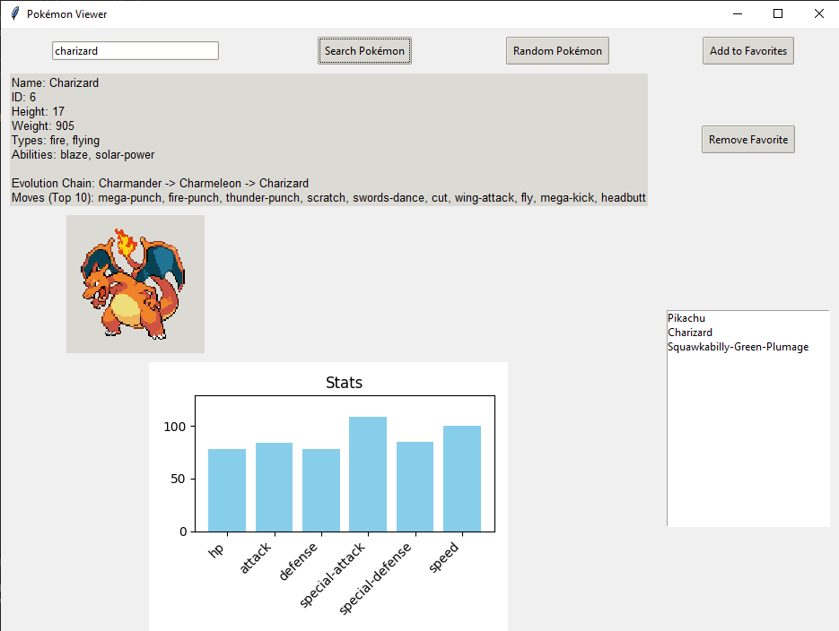

# ⚡ Pokémon Viewer App

This project is a modern desktop application developed using **Python** and **Tkinter**, powered by **PokeAPI**. It allows users to search for Pokémon, view detailed statistics via dynamic graphs, explore evolution chains, and manage a personal favorites list.

## Screenshot
|  |

## 🚀 Features

* **🔍 Smart Search:** Fast search functionality with an **Autocomplete** feature to find Pokémon by name.
* **🎲 Random Discovery:** Discover new Pokémon instantly with the "Random Pokémon" button.
* **📊 Stats Graph:** Dynamic **Matplotlib** bar charts displaying base stats like `HP`, `Attack`, `Defense`, etc.
* **❤️ Favorites System:** Easily add or remove Pokémon to/from your favorites list for quick access.
* **🧬 Detailed Information:**
    * Official Sprite Images
    * Types and Abilities
    * Height and Weight
    * Evolution Chain
    * Top Moves

## 🛠️ Technologies Used

* **Python 3.x**: Core programming language.
* **Tkinter**: For the Graphical User Interface (GUI).
* **Requests**: To fetch data from the API.
* **Pillow (PIL)**: To process and display images.
* **Matplotlib**: To render statistical graphs.
* **PokeAPI**: The comprehensive data source (Free REST API).

## ⚙️ Installation

Follow the steps below to run the project on your local machine.

### 1. Download the Files
Download the project files (`main.py` and `pokemon_ui.py`) to a folder.

### 2. Install Required Libraries
Open your Terminal or Command Prompt (CMD) and run the following command to install the necessary packages:

bash:
pip install requests Pillow matplotlib

▶️ Usage
After the installation is complete, run the main.py file:

Bash

python main.py
How to use:

Type a Pokémon name (e.g., "Charizard") in the search bar or select from the dropdown.

Click the Search button.

View the stats, evolution chain, and details.

Click Add to Favorites to save the Pokémon to your list.

📂 Project Structure
main.py: The entry point of the application. Run this file to start the app.

pokemon_ui.py: The main module containing the UI design, API integration, and application logic.

⚠️ Notes
An active internet connection is required to fetch data.

There might be a slight delay (1-2 seconds) on the first launch while the Pokémon name list is being loaded.
